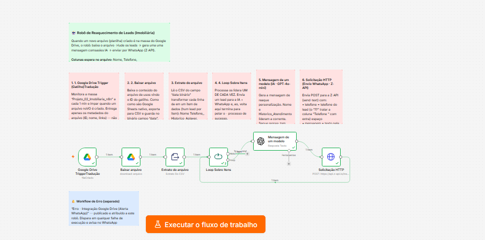

# 🤖 MOTOR COGNITIVO PARA REAQUECIMENTO E RESGATE DE LEADS IMOBILIÁRIOS

Desenvolvimento de uma infraestrutura em nuvem integrada a modelos de Inteligência Artificial (**GPT-4o-mini**) focada em resolver o maior gargalo do mercado imobiliário: a perda de faturamento por abandono de bases antigas. 

O sistema realiza a varredura, interpretação e abordagem ultra-humanizada via WhatsApp de leads antigos (frios), convertendo contatos esquecidos em novas reuniões de agendamento com esforço manual zero para as equipes de vendas.

---

## 📊 Arquitetura Visual do Circuito no n8n

---

## 🚀 A ARQUITETURA DO SISTEMA: 3 NÍVEIS DE MATURIDADE

Para atender desde o corretor autônomo até redes de imobiliárias de grande porte, o sistema foi arquitetado em três camadas modulares de implementação:

### 📂 NÍVEL 1: ENTRADA SOB DEMANDA (VERSÃO DRIVE)
*Ideal para Corretores Autônomos e Operações Enxutas.*
* **Como funciona:** O profissional faz o download do relatório de contatos antigos do seu sistema imobiliário em formato de planilha de Excel (`.xlsx`). Ele organiza os dados sob três colunas padrão (`Nome`, `Telefone` e `Histórico de Atendimento`) e simplesmente arrasta esse arquivo para dentro da pasta de entrada do Google Drive.
* **A Automação:** O motor em nuvem monitora a pasta 24h por dia. No segundo em que identifica a entrada do arquivo de Excel, o bloco de tradução digital do n8n lê a lista de clientes contida ali de dentro, desfragmenta as linhas e envia as informações de forma cadenciada para a Inteligência Artificial realizar as abordagens humanizadas no WhatsApp.

### 🔌 NÍVEL 2: INTEGRAÇÃO NATIVA EM FLUXO CONTÍNUO (VERSÃO CRM ADVANCED)
*Ideal para Imobiliárias Consolidadas.*
* **Como funciona:** Elimina permanentemente o uso de planilhas manuais. O sistema opera via conexões de API seguras integrado diretamente ao software de gestão (CRM) da empresa (Ex: *Kenlo, RuaDois, HubSpot, Pipedrive*).
* **A Automação:** Através de uma varredura agendada (`Schedule Trigger`), o sistema recolhe na base do CRM apenas os leads que receberam a etiqueta eletrônica **"Ativar Robo"**. Após o disparo pelo WhatsApp, o robô faz uma baixa automática na API, retirando a etiqueta e salvando uma nota com o texto exato gerado pela IA no prontuário interno do cliente.

### ⚡ NÍVEL 3: CAPTURA IMEDIATA E REDUNDÂNCIA MÍDIA (MÓDULOS ROBUSTOS)
*A Máquina de Atração de Elite em Tempo Real.*
* **Como funciona:** Conexão direta com os servidores de anúncios da Meta (**Instagram Ads e Facebook Ads**) e formulários nativos do site da imobiliária.
* **A Automação:** No milésimo de second em que o potencial comprador clica em um anúncio de imóvel ou demonstra interesse no portal, o dado é capturado via Webhook. O robô cognitivo processa o contexto do anúncio imobiliário específico e realiza a primeira abordagem humanizada de boas-vindas no WhatsApp em menos de 60 segundos, garantindo a máxima taxa de conversão do lead quente.

---

## 📲 Exemplo Prático de Abordagem Cognitiva
*(Aqui você pode colocar o print do celular mostrando a mensagem humana chegando no WhatsApp)*

---

## 🔄 O PROTOCOLO DE RETORNO E SEGURANÇA OPERACIONAL

* **Atendimento Híbrido (IA + Humano):** A Inteligência Artificial executa estritamente o reaquecimento inicial de abertura de portas. No segundo exato em que o lead responde no WhatsApp, o robô afasta-se de forma silenciosa e a notificação é entregue ao celular do corretor de plantão. O fechamento é 100% humano.
* **Fila Humana Cadenciada:** O ecossistema processa os dados aplicando delays randômicos de 120 a 180 segundos entre cada mensagem, emulando perfeitamente o comportamento humano de digitação para garantir a blindagem do chip de WhatsApp do cliente contra banimentos.

---

## 🛠️ TECNOLOGIAS UTILIZADAS
* **Orquestração de Dados:** n8n (Arquitetura em Nuvem VPS).
* **Camada Cognitiva / IA:** OpenAI API (GPT-4o-mini).
* **Mensageria / Gateway:** Z-API (Criptografia ponta a ponta).
* **Bancos de Dados e Sincronização:** Google Workspace APIs & CRM Rest APIs.

---

## 💼 CONTATO / DEMONSTRAÇÃO COMERCIAL

Quer resgatar o faturamento oculto que está travado na base antiga de clientes da sua imobiliária?

👉 👉 [**CLIQUE AQUI PARA FALAR DIRETO COMIGO NO WHATSAPP**](https://wa.me/5511993388623) e agende uma demonstração visual de 15 minutos do sistema rodando ao vivo!
 e agende uma demonstração visual de 15 minutos do sistema rodando ao vivo com os seus próprios dados!

